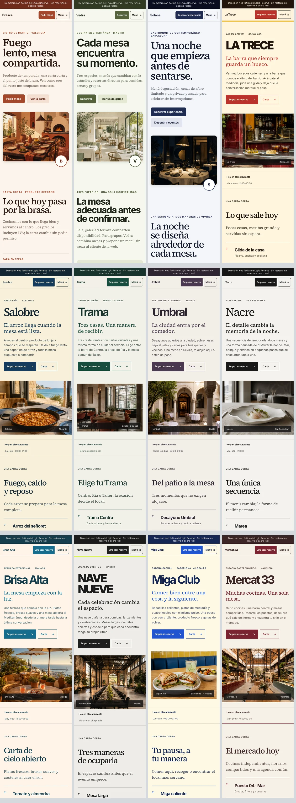
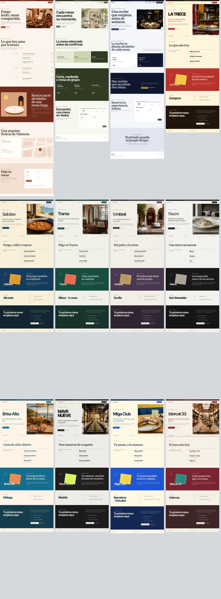

# Auditoría del catálogo · 5–6 de septiembre de 2026

Alcance: las doce webs y sus doce fichas, español e inglés, catálogo y previews de la home. Revisión de composición completa en escritorio y móvil, navegación, legibilidad, imágenes y recorridos de solicitud/reserva. Los cambios previos del worktree se conservan.

## Correcciones

- Nueve fotografías originales de OpenAI, una por formato: barra de vermut, arrocería, comedor urbano, patio andaluz, alta cocina, terraza, nave de eventos, bocadillos y mercado gastronómico. Las tres marcas profundas conservan sus imágenes aprobadas. Cada fotografía nueva dispone de AVIF de 640, 960 y 1600 px, descripción ES/EN y prioridad de carga en portada.
- Menú móvil compartido y nativo en las doce webs: secciones, idioma y destinos de cada marca. Teclado, Escape, cierre al seleccionar o salir y funcionamiento sin JavaScript. Reserva visible fuera del desplegable. Anclajes separados de las cabeceras fijas.
- Portadas sin recortes de texto, tamaños y espaciados adaptados a pantallas pequeñas, imágenes de proporción estable y cartas con jerarquía clara. Se reduce la altura de gráficos repetidos y se conserva la dirección visual de cada tema.
- Textos de las nueve webs escritos para el visitante del restaurante. La explicación de los límites de la demo permanece en el aviso y en la sección de solicitud. El contacto conserva `?theme=` y el idioma.
- Precios de las cartas de Solane y Vedra en el flujo de sus tarjetas: no pueden superponerse a una descripción larga. Introducción de Solane con título y texto correctamente agrupados.
- Contraste reforzado en etiquetas, párrafos sobre color y numeración; fondos fotográficos del catálogo sin formas superpuestas que oculten el sujeto.
- Alcance comercial compartido: Brasca presenta web y formulario de solicitud local; Vedra y Solane mantienen reserva y gestión; las otras nueve conservan su límite de web sin motor.
- 48 capturas de portada independientes de la evidencia operativa: doce temas × dos idiomas × dos viewports. Las fichas y previews muestran la web real y el idioma correcto. Se corrige el corte de viewport de la ficha para que la imagen móvil y su marco cambien simultáneamente.

## Recursos y reproducción

- Originales y prompts: `apps/web/assets/heroes/generated/catalogue-v1/`; generados uno a uno con la herramienta integrada de OpenAI.
- `pnpm images` reproduce los AVIF a partir de los originales y del inventario de prompts, conservando las proporciones de cada colección.
- Recursos servidos: `apps/web/public/images/heroes/*-v1-{640,960,1600}.avif`.
- Previews: `apps/site/public/images/theme-previews/{es,en}/` y su manifest con SHA-256. Con un Worker local ya iniciado: `CAPTURE_ORIGIN=http://127.0.0.1:8791 pnpm fotos:temas`. Recompilar después para incorporar las capturas.
- Evidencias operativas: se conserva el contrato de `pnpm fotos`, separado de las portadas comerciales.
- Regresión específica: `tests/e2e/catalogue.spec.ts`. Recorre las 24 webs y las 24 fichas a 320, 375, 430, 768, 1024 y 1366 px; comprueba texto fuera de su bloque, imágenes, navegación, tamaños táctiles del menú, foco, anclajes y filtros. Incluye menú sin JavaScript y recorridos locales a 320 px.

## Evidencia visual

Las composiciones siguientes permiten comparar las doce direcciones. La inspección incluyó las páginas completas y sus secciones inferiores; el resumen móvil muestra las portadas.

## Validación

- 14/14 pruebas específicas del catálogo: 144 combinaciones de web/idioma/ancho y 144 de ficha/idioma/ancho, además de filtros, menú sin JavaScript y solicitudes/reservas a 320 px.
- Inspección visual de las doce webs completas a 375 y 1366 px; revisión adicional de cartas, historia, horarios y solicitud en móvil. Contraste de los textos revisados sin incidencias.
- 48/48 portadas reproducibles byte a byte. Digest SHA-256 sobre `JSON.stringify(manifest.captures)`: `79d7b6dbf08ea96f5b58432a49feee10189fe34adbf8763d76d7828ef9370e4b`.
- `pnpm images` reproduce los 36 AVIF de las doce portadas y conserva los otros nueve AVIF legados: 45/45 archivos sin cambios de hash.
- Wrangler 4.123 / ProxyWorker se cerró durante las primeras ejecuciones. Esos intentos no se contabilizan como regresión completa. Para terminar se ejecuta el mismo bundle emitido por Wrangler directamente con Miniflare 5.20260811.1-alpha / workerd 1.20260811.1, los bindings locales de assets y Durable Objects y `LEADS_TRANSPORT:disabled`. Las comprobaciones funcionales usan el Worker; el servidor estático se usa únicamente para capturas.
- 92/92 escenarios funcionales verificados por bloques contra el Worker local, incluidos reserva → gestor, espera, eventos, depósitos, permisos y contactos contextuales. Se corrigieron referencias antiguas a la imagen del hero y al CTA retirado; el test de consentimiento comprueba ahora las cuatro acciones actuales.
- 42/42 comparaciones visuales de las escenas contractuales en verde con el comparador de Playwright (`threshold: 0.1`, `maxDiffPixels: 0`). 40/42 hashes idénticos; las otras dos imágenes solo difieren en 57 y 6 píxeles de rasterizado. PNG originales, sin retoques. Renderer fijado a Chromium Headless Shell 151.0.7922.34; protocolo y digest documentados en `SALES-ASSETS.md`.
- El runner deja de esperar imágenes lazy fuera del carrusel, decodifica de nuevo tras el recorte final y exige dos frames consecutivos iguales antes de guardar cada captura.
- `pnpm check`: 28/28 tareas, 160 tests. Build final de 102 páginas y 3.774 referencias internas sin rutas ni recursos ausentes.
- Tras incorporar las capturas al build, 8/8 comprobaciones adicionales verifican manifiesto, metadatos, carruseles, continuidad del correo y recorridos comerciales.

No se ha desplegado ni enviado correo real. Las comprobaciones documentadas cubren Chrome y los seis anchos indicados; no equivalen a una prueba física en todos los modelos de teléfono.
